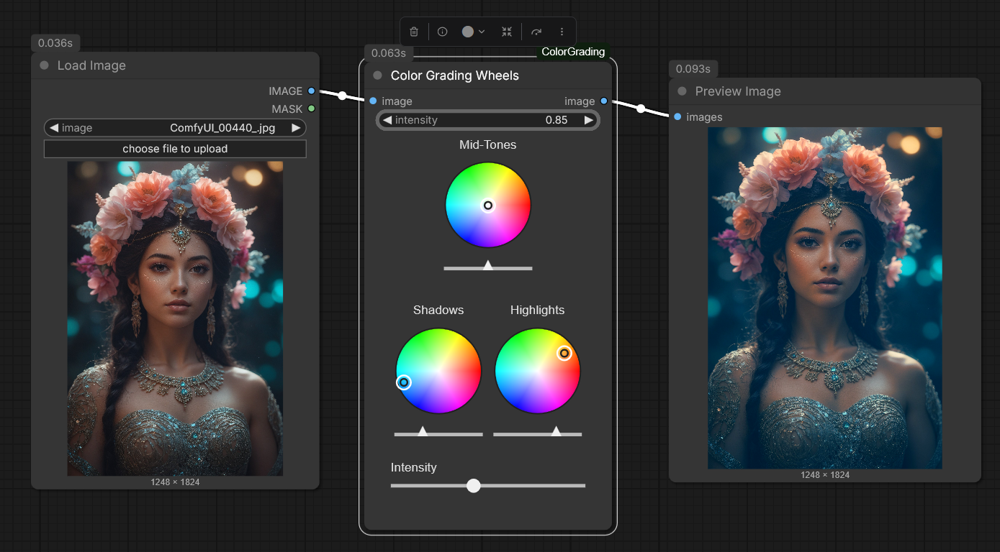

# ComfyUI Color Grading Wheels

Custom Node forr ComfyUI with 3 Color Wheels (Shadows, Midtones, Highlights), each with a threshold slider and a master intensity slider.

## Features

- three interactive color wheels
- each color wheel with it's own threshold slider
- global intensity slider

## Installation

1. just place files into `ComfyUI/custom_nodes/ComfyUI_ColorGrading`.
2. restart ComfyUI.
3. search node in ComfyUI: `Color Grading Wheels`.

## Additional info

- the Node takes standard ComfyUI `IMAGE` input.
- The color wheels write their values into hidden float-widgets, this way values are saved within the workflow.
